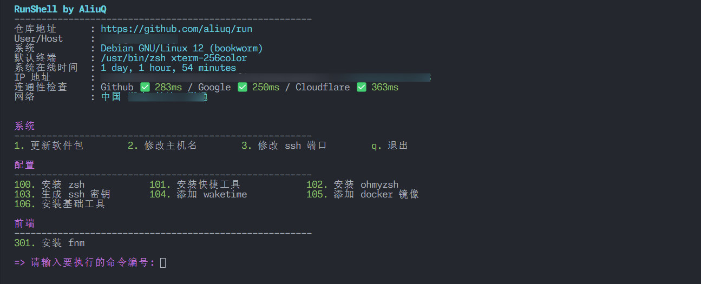

# run

在 Debian 和 Ubuntu 系统上执行同一个脚本来管理相关操作

```bash
sh <(curl -sL https://run.xod.cc)

# 使用代理，通过网络请求来判断是否使用代理
sh <(curl -sL https://sh.xod.cc)

# 使用代理，强制脚本内部使用代理
sh <(curl -sL https://sh.xod.cc) --use-proxy
```

_非国内服务器访问 https://sh.xod.cc 大概率会被 Cloudflare 策略拦截_


